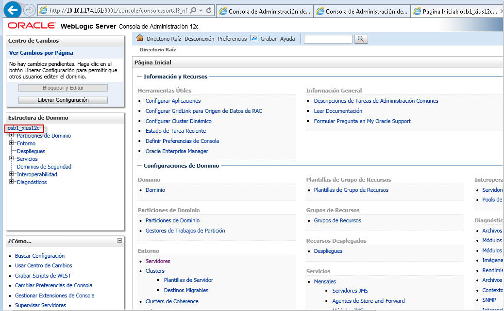
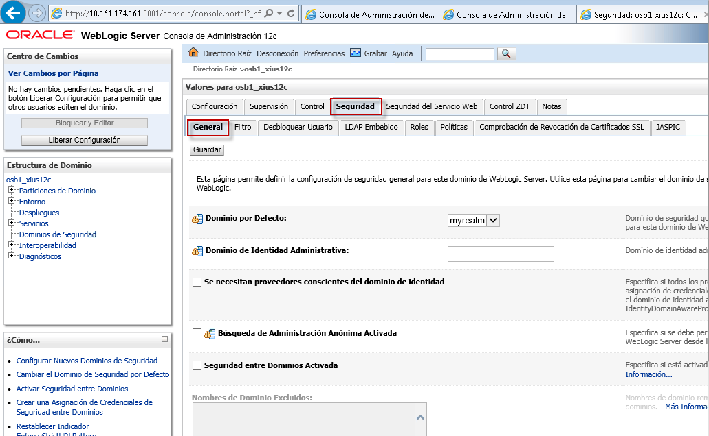
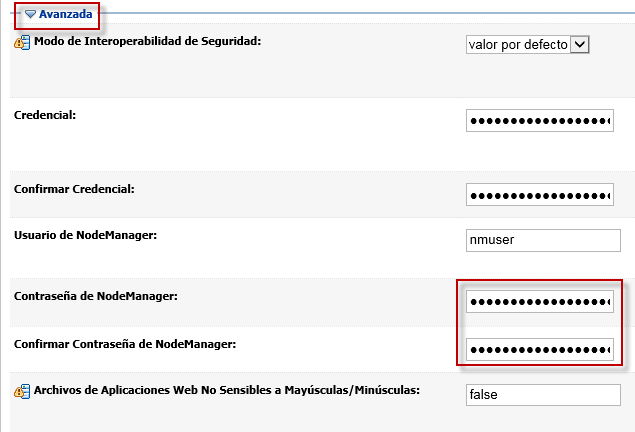
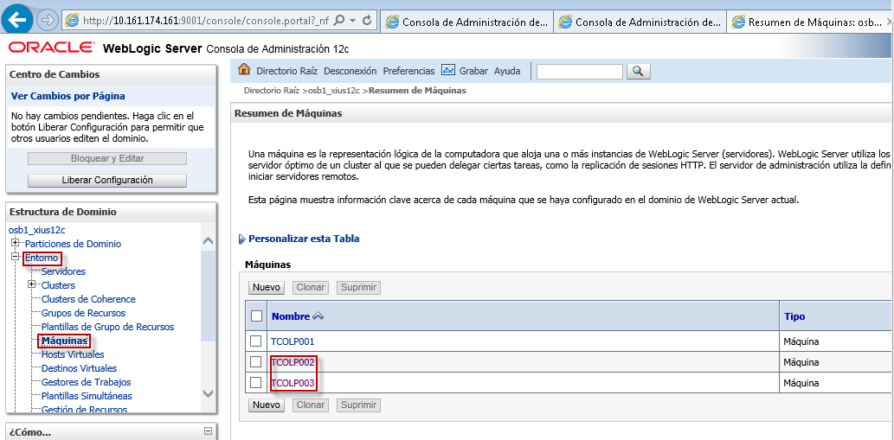
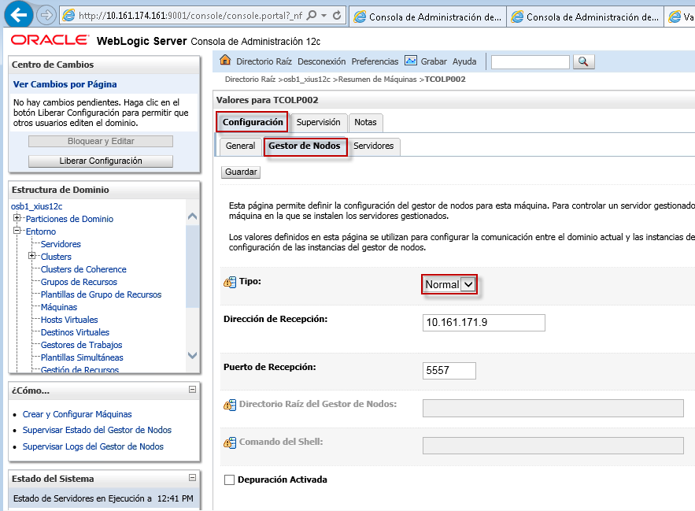
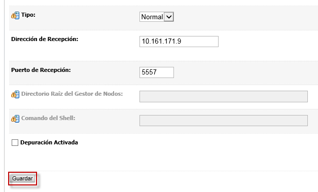

Actualización de Credenciales y Configuración a Tipo Normal del Node Manager
========

Las Credenciales del Node Manager al momento de la creación del dominio se establecen de manera aleatoria por seguridad, y por esto se debe ingresar nuevamente el usuario y la contraseña del Node Manager.

- Primero ingresamos a la consola administrativa de Weblogic y seleccionamos el dominio:

- Luego Seguridad -> General, y en la pestaña Avanzada se encuentran las credenciales del node manager, a donde ingresaremos nuevamente la contraseña:

- Luego, las máquinas que tenemos asociadas a servidores manejados las modificamos a tipo normal y guardamos los cambios. Esto para permitir la comunicación entre el Admin Server y las máquinas, ya que no se tiene asociado ningun certificado al puerto de las máquinas, y con la configuración SSL no funcionará:

