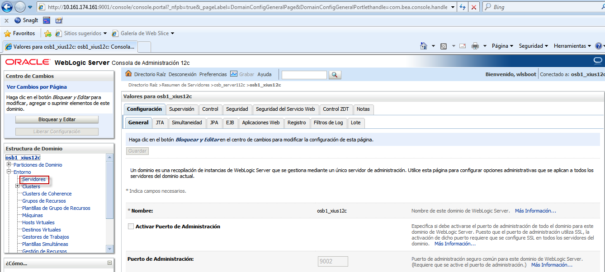

Desactivación del parámetro Host Name Verification
========

- Dentro de la consola administratrativa presionamos la opción servidores:

- Seleccionamos el servidor a desactivar el parámetro: 

- Seleccionamos la opción SSL:

- Luego en la pestaña Avanazada:

- En Verificación de Nombre de Host elegimos ninguno:

- Guardamos los cambios:

- Luego hacemos el mismo procedimiento con los demás servidores gestionados en caso de tenerlos:

