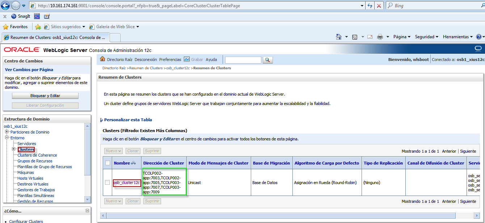
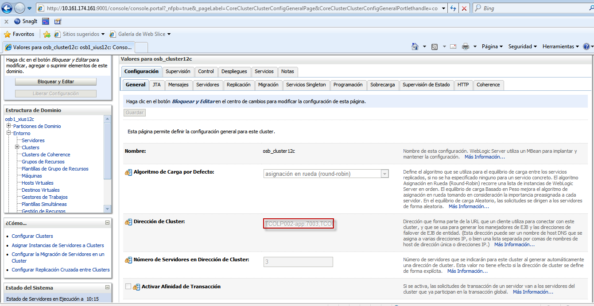

Agregar Direcciones del Cluster.
========

- Seleccionamos dentro de la consola administrativa la pestaña de cluster y hacemos click en el cluster para agregar las direcciones que se reflejarán en la columna "Dirección de Cluster":

- En Dirección de Cluster vamos a definir las direcciones que van a utilizar los clientes para conectar con este cluster, y activamos los cambios en el centro de cambios: 

