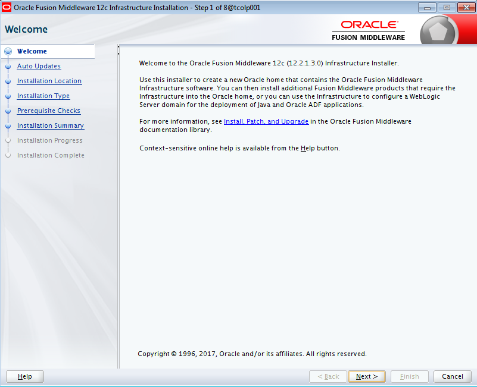
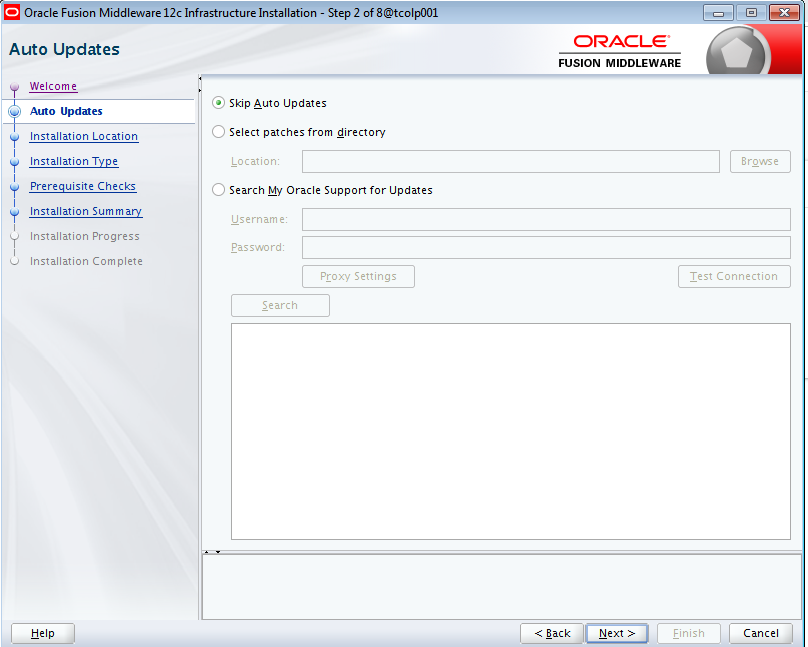
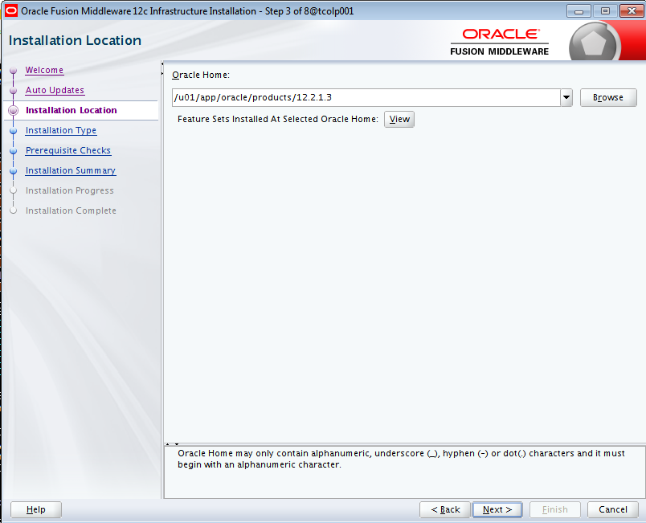
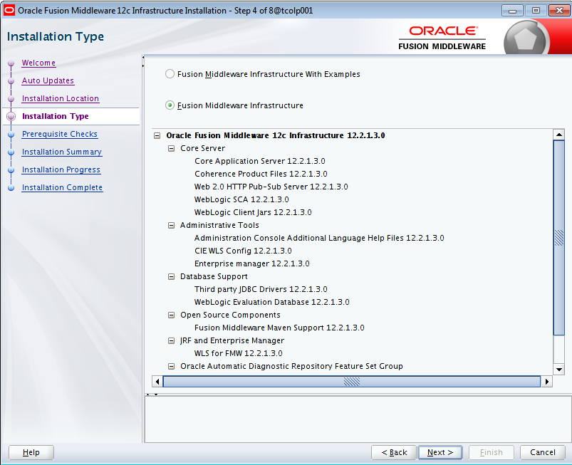
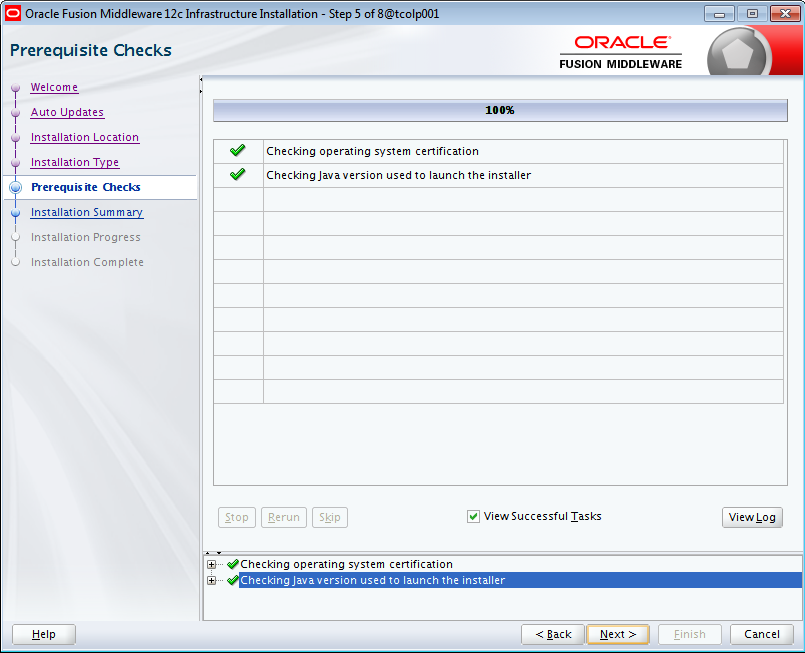
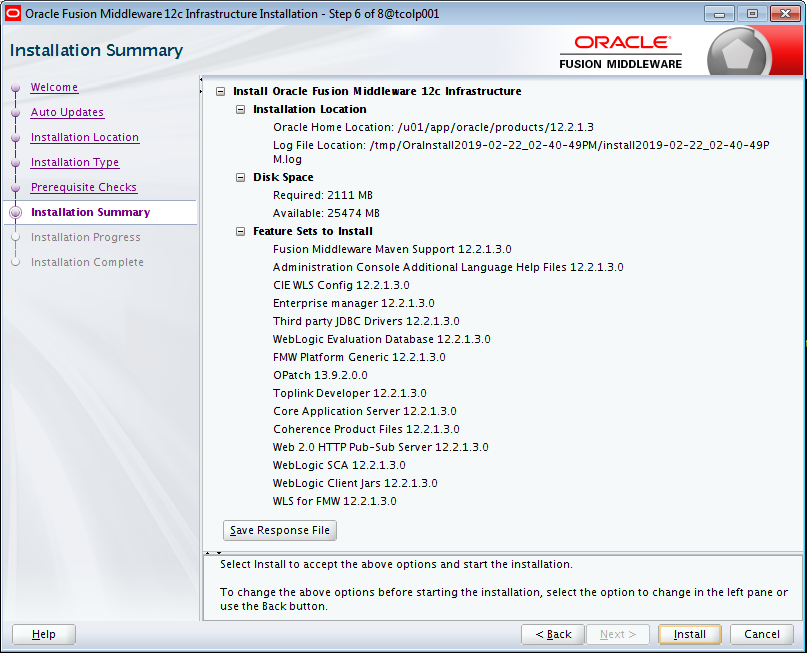
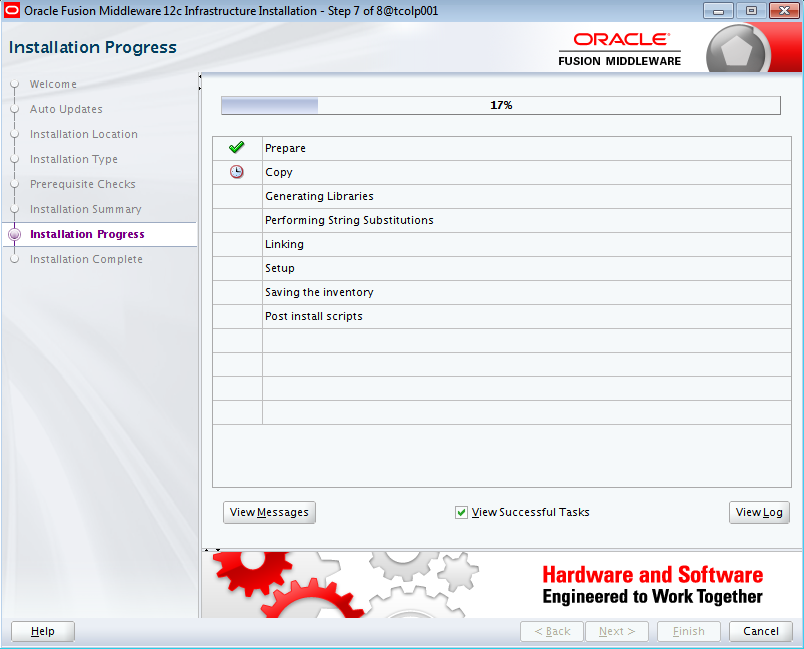
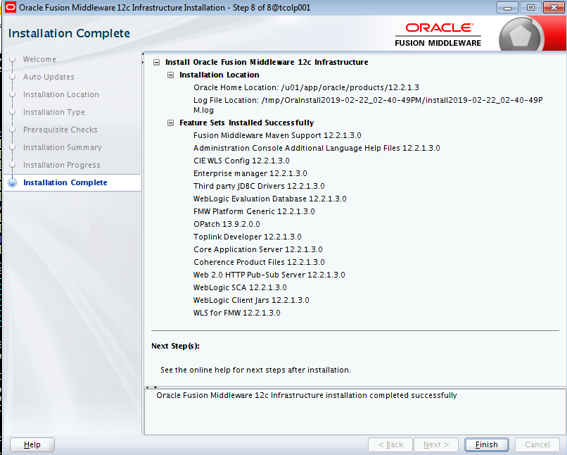

Instalación de Oracle Fusion Middleware
========

- Requisitos:
1. Tener un java instalado que sea compatible con la versión de Oracle Fusion Middleware a Instalar
2. Verificar que el entorno de las ventanas X esté operativo.

- Ejecutamos el jar de instalación de Oracle Fusion Middleware:

- Dejamos las actualizaciones por defecto:

- Indicamos la ruta de instalación de oracle:

- Decidimos el tipo de instalación (con o sin ejemplos):

- La instalación verificará los pre-requisitos de sistema operativo y java:

- Nos muestra el resumen de la instalación:

- Esperamos a que el progreso de la instalación llegue al 100 %:

- Finalmente nos indicará que la instalación a sido completada:

