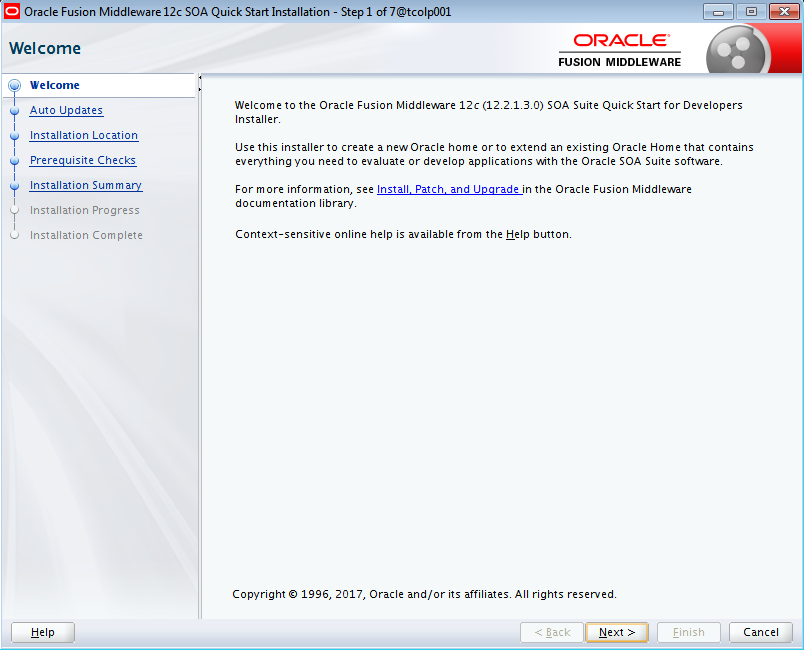
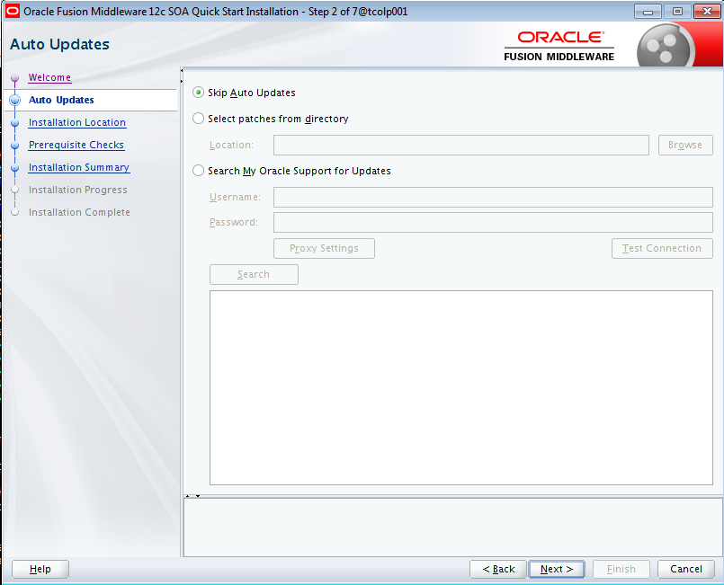
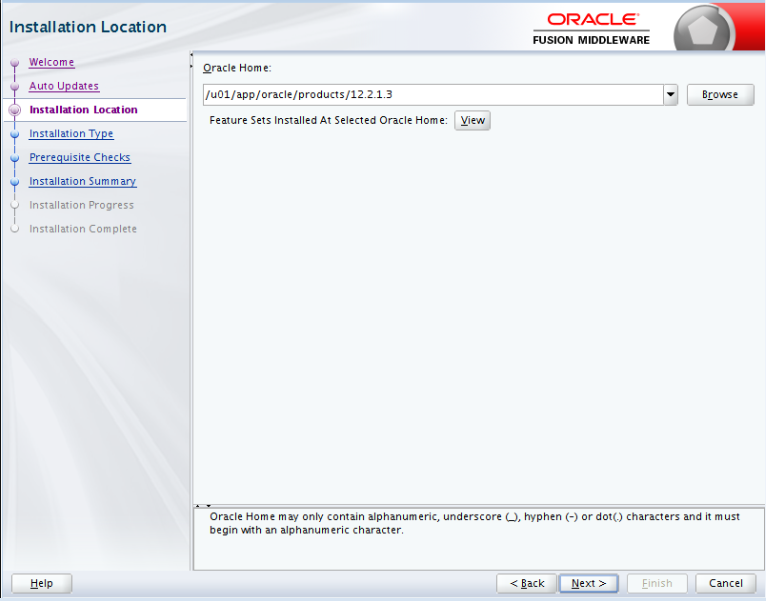
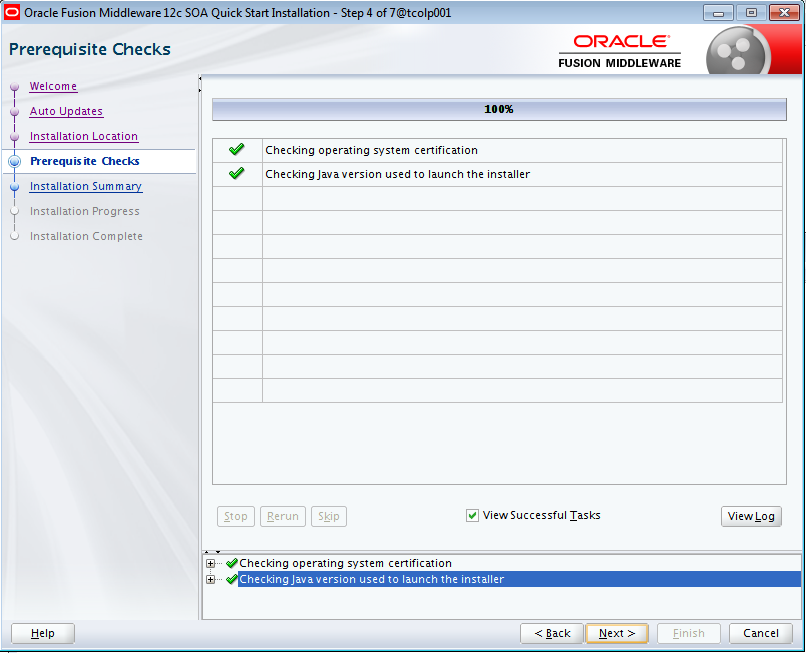
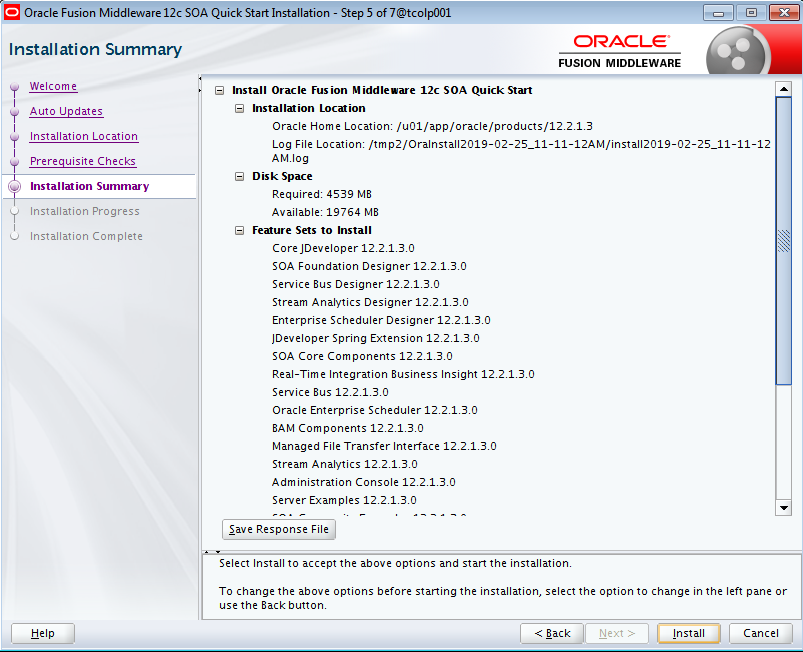
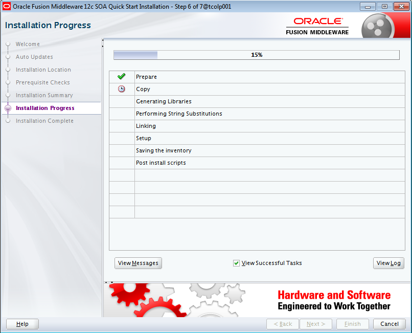
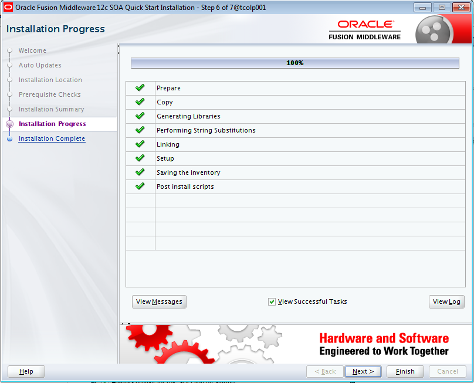
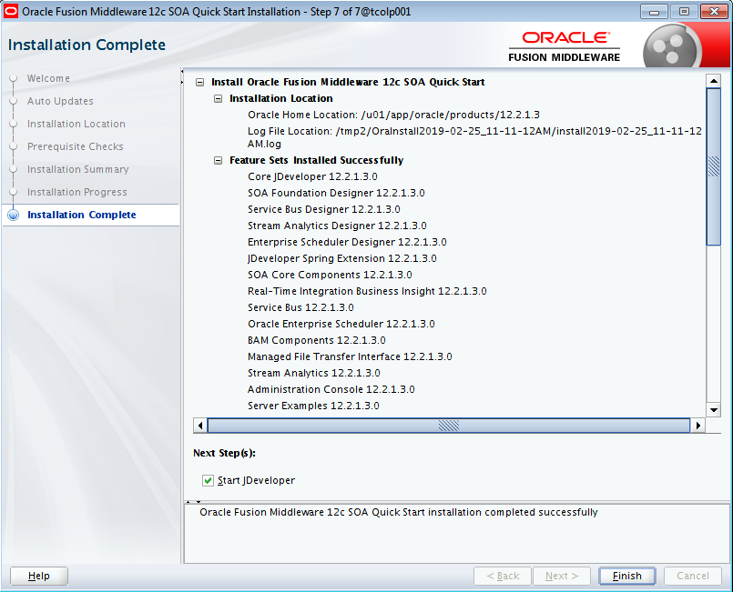

Instalación de Oracle SOA Suite
========

- Requisitos:
1. Tener un java instalado que sea compatible con la versión de Oracle SOA Suite a Instalar.
2. Verificar que el entorno de las ventanas X esté operativo.

Debemos instalar el jar de Oracle Soa Suite o el jar de OSB para tener las funcionalidades de Oracle Service Bus.

Esta instalación se debe realizar en todos los servidores que conformaran la plataforma OSB.

- Ejecutamos el jar de instalación de Oracle SOA Suite, en este caso "fmw_12.2.1.3.0_soa_quickstart.jar". Son 2 jar y se deben colocar en la misma ruta, y ejecutar el nombrado anteriormente:

- La instalación nos da la bienvenida:

- Especificamos las actualizaciones por defecto:

- Indicamos la ruta de instalación que debe ser igual a la ruta a donde instalamos el Oracle Fusion Middleware:

- La instalación chequea los pre-requisitos de sistema operativo y java.

- Nos muestra el resumen de la instalación:

- Esperamos a que el progreso de la instalación llegue al 100 %:

- Finalmente nos indicará que la instalación ha sido completada:

