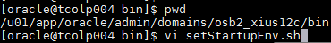
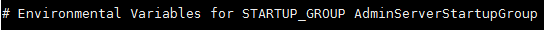
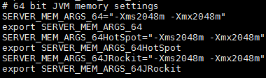
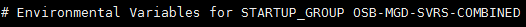
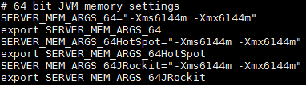

Aumentar memoria de JVM de Admin Server y Servidores gestionados.
========

En ambientes productivos, debemos aumentar la memoria de nuestras JVM, para así lograr un mejor performance de la aplicación, y una mejor prestación de servicio de cara al cliente. Y en cuanto a la administración evitar lentitud en momentos críticos que se requiera tomar acciones.

- En la versión 12c debemos editar el archivo setStartupEnv.sh, ubicado en $DOMAIN_HOME/bin:

- Buscamos el grupo asociado al Admin Server, a donde estará la definción de la memoria: 

- Debemos realizar la actualización de la memoria dependiendo del Java que estamos utilizando, bien sea JRockit o HotSpot, y definimos el tamaño según la necesidad:

- Luego buscamos el Server Group al que asociamos los servidores gestionados cuando creamos el dominio (por eso se recomienda asociarlos todos al mismo grupo, en caso de querer que se ejecuten con los mismos argumentos):

- Y procedemos de igual manera a definir el tamaño de las JVM, según nuestra necesidad (tomará el cambio para todos los gestionados del grupo):

