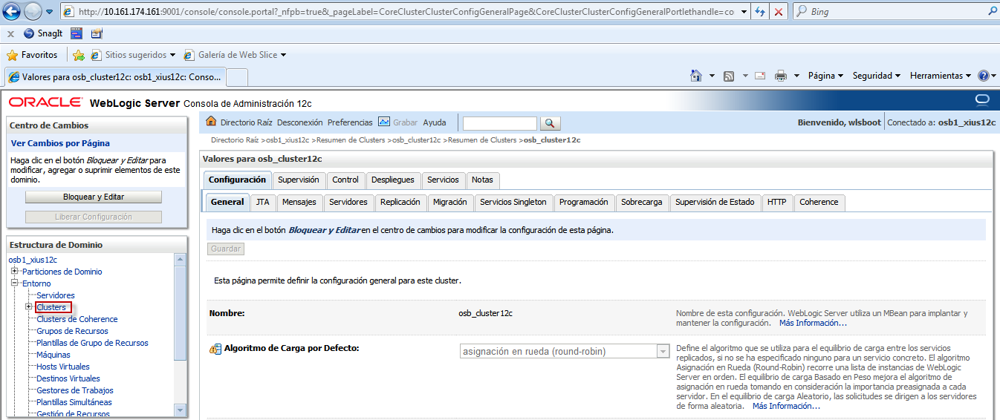
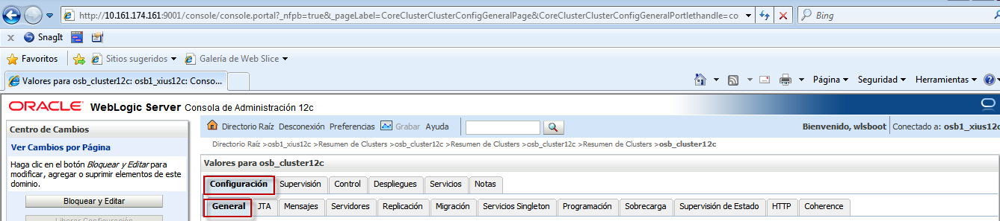
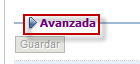
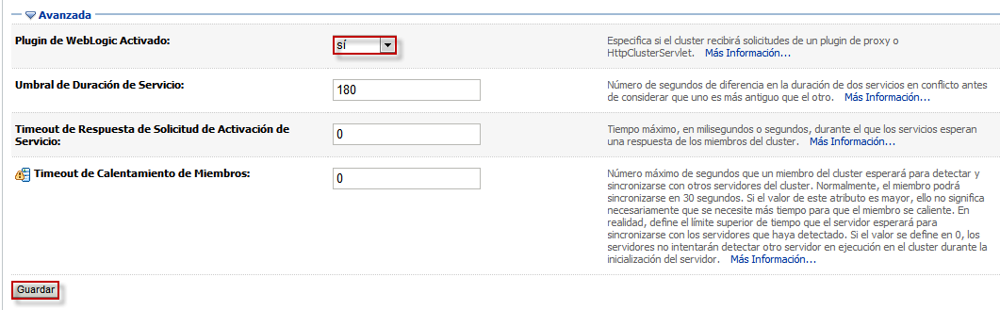

Activación del plugin de Weblogic (solo si se utiliza OHS)
========

- Primero seleccionamos la pestaña Clusters: 

- Luego damos click sobre el nombre del cluster: 

.. image:: ../imagenes/plugin/26-03-201916-19-02

- Nos posicionamos en las pestañas Configuración - General:

- Luego en la pestaña Avanazada:

- En Plugin de Weblogic Activado elegimos sí y guardamos los cambios:

