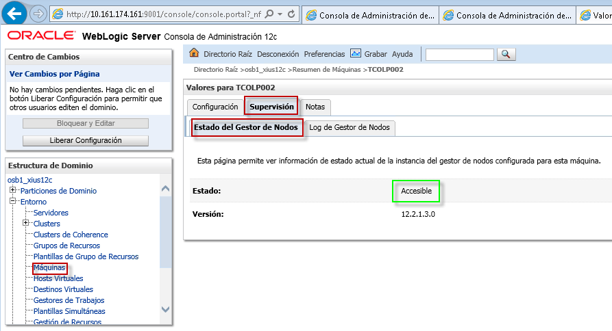

Propagación del Dominio a Otras Máquinas
========

Cuando tenemos un dominio con servidores manejados en servidores físicos o virtuales diferentes, se debe propagar el dominio a tantos servidores estén involucrados.

- Primero empaquetamos el dominio con el ejecutable pack en el servidor a donde se creó dicho dominio como se muestra en la imagen:

- Luego desempaquetamos el dominio en las otrás máquinas o servidores con el comando unpack de la siguiente manera:

- Luego ejecutamos el Weblogic Scripting Tool (wlst) en la máquina a donde desempaquetamos el dominio, y nos conectamos al Admin Server con las respectivas credenciales y url de la siguiente manera:

- Procedemos a enrrolar el node manager de la máquina con el Admin Server para que pueda ser gestionado desde la consola administrativa como se muestra en la imagen:

- Luego iniciamos el node manager de esa máquina:

- Si chequeamos el estado del gestor de nodos de esta máquina, debe estar Accesible:

- Esto quiere decir que ya podemos administrar los servidores manejados de esta máquina a través de la consola administrativa (Admin Server):

