Creación de Repositorio de Metadata
========

- Requisitos:
1. Tener un java instalado que sea compatible con la versión de rcu a Instalar.
2. Verificar que el entorno de las ventanas X esté operativo.
3. Tener instalado Oracle fusion Middleware y Oracle SOA Suite.

Esta creación de repositorio se debe realizar por cada dominio OSB que se vaya a crear

- Ejecutamos el utilitario rcu, ubicado dentro del directorio de instalación de oracle y seguidamente nos mostrará la pantalla de bienvenida de la instalación:

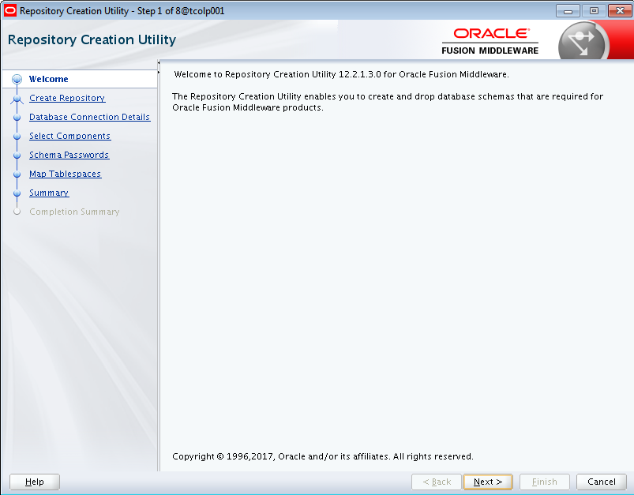

- Indicamos que deseamos crear un repositorio:

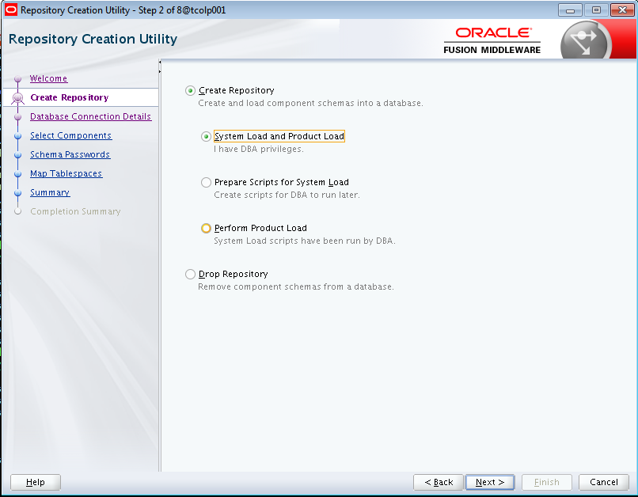

- Ingresamos los parámetros de conexión a la base de datos. La conexión se debe realizar con un usuario que tenga rol de sysdba, en este caso sys:

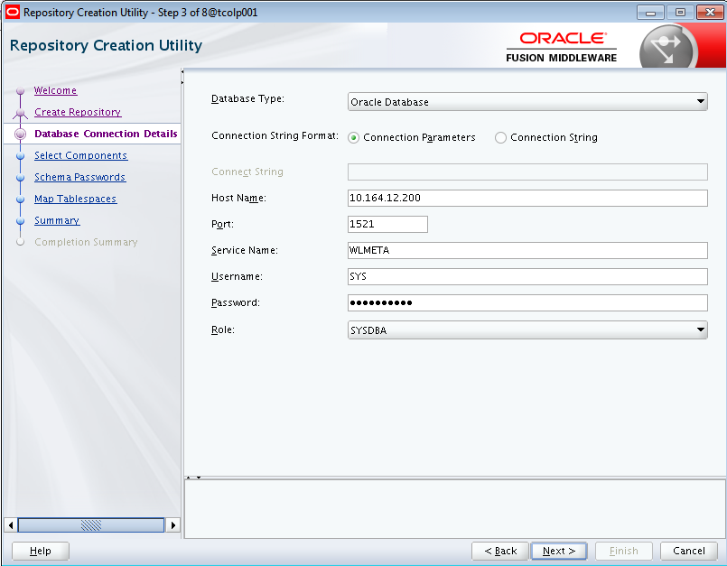

- Si la conexión es satisfactoria nos mostrará esta ventana:

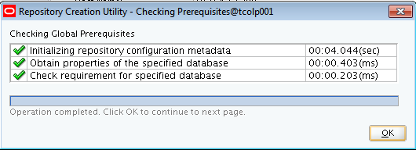

- Indicamos el nombre del prefijo y los componentes a crear que en nuestro caso son estos:

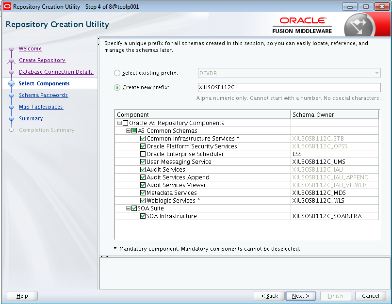

- Se chequean los pre-requisitos para la creación de cada componente:

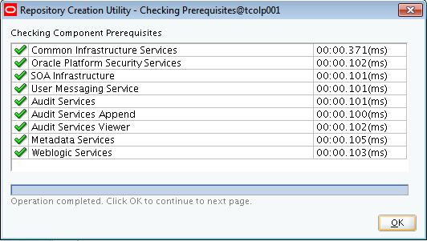

- Se debe ingresar el password de los schema users:

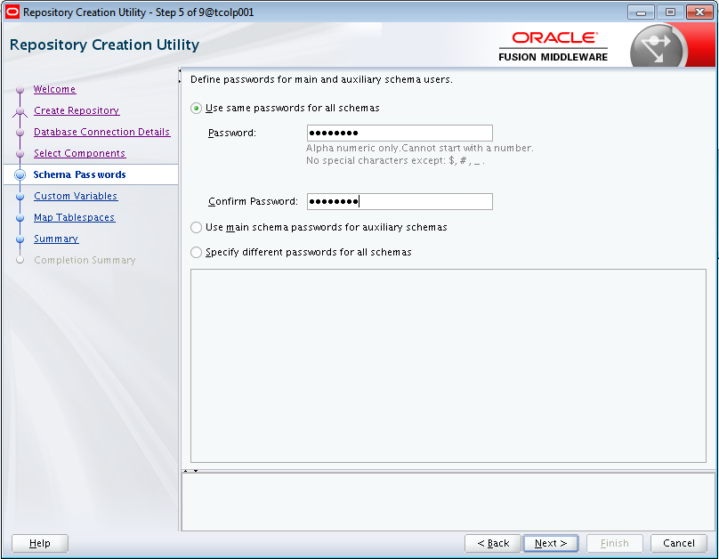

- Se personalizan las variables del componente SOA Infraestructure:

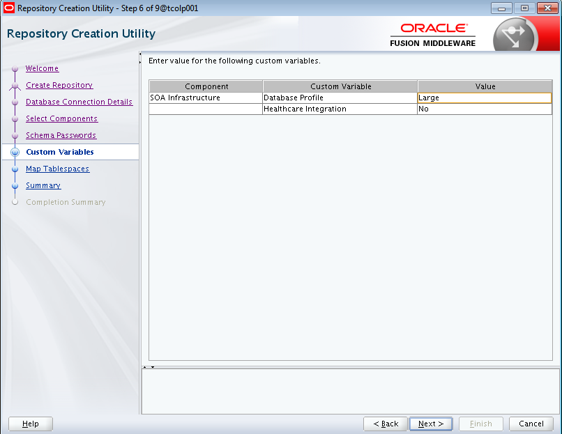

- Se dejan los tablespaces que se crearán por defecto:

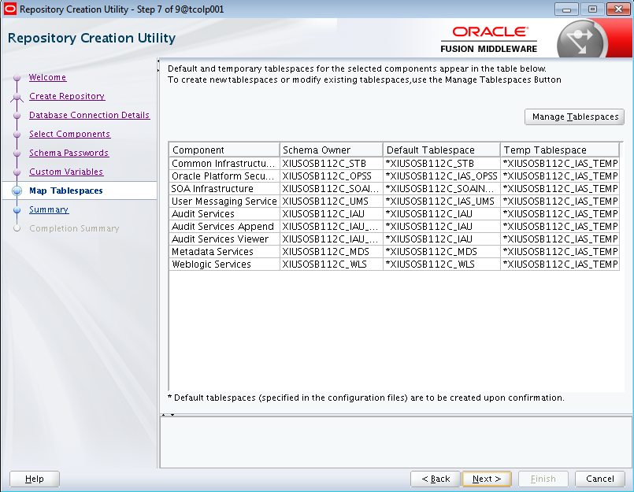

- Seleccionamos ok para que se proceda a crear los tablespaces:

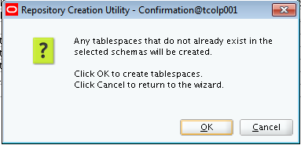

- Si los tablespaces fueron creados satisfactoriamente, nos mostrará esta ventana de la siguiente manera:

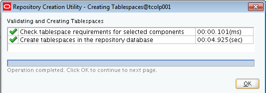

- Nos mostrará el resumen para la creación de los componentes:

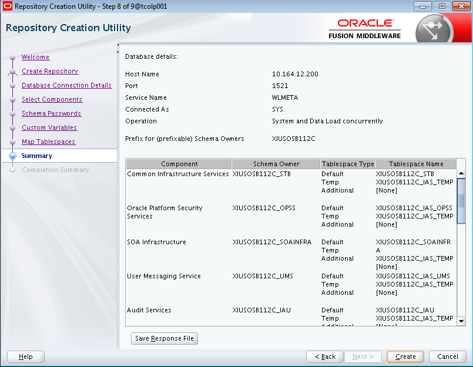

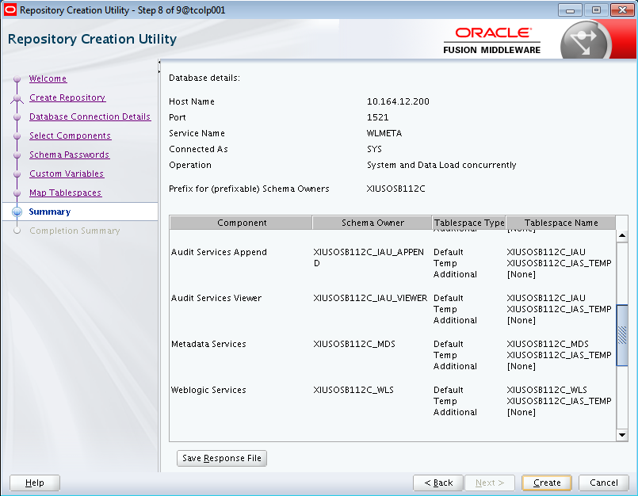

- Una vez completada la instalación, todos los componentes deben mostrar estatus "Success":

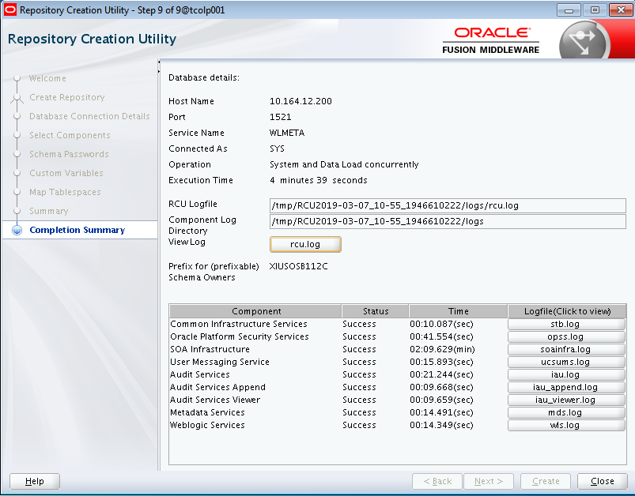
