Exportar e Importar Servicios.
=======

En nuestro caso se está migrando de Oracle Service Bus, de la versión 11g a 12c, por lo que debemos exportar los servicios del Bus de 11g e importarlos en 12c. Estas migraciones deben ser consultadas con el área de desarrollo de sotfware, ya que al cambiar el java, hay cambios de librerias que pueden afectar el funcionamiento de la aplicación en el nuevo entorno.

- Ingresamos a la consola administrativa del bus de 11g: 

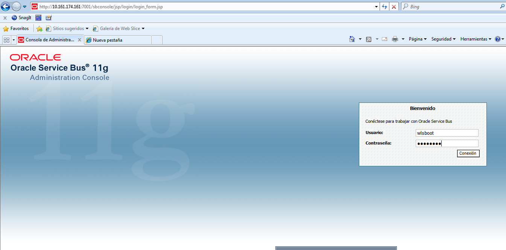

- Seleccionamos la pestaña Administración del Sistema:  

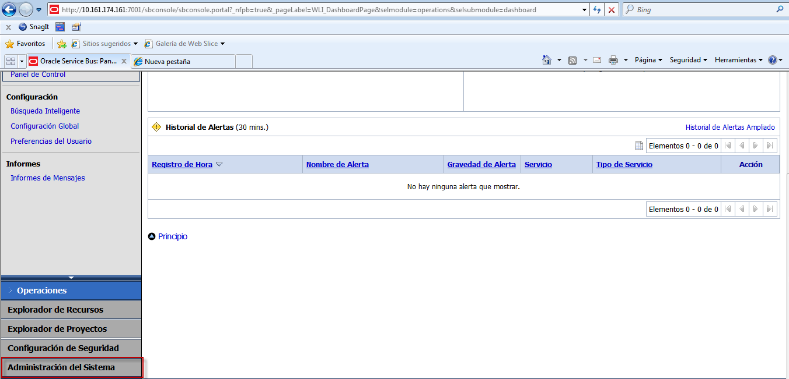

- Le damos a la opción Exportar Recursos:

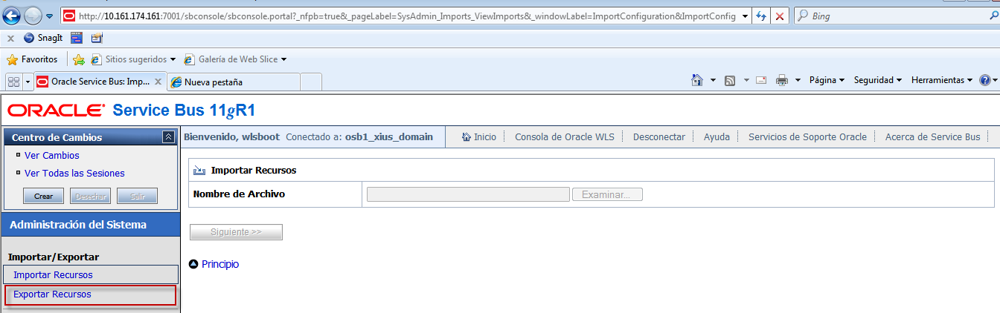

- Seleccionamos el proyecto y luego la opción Exportar:

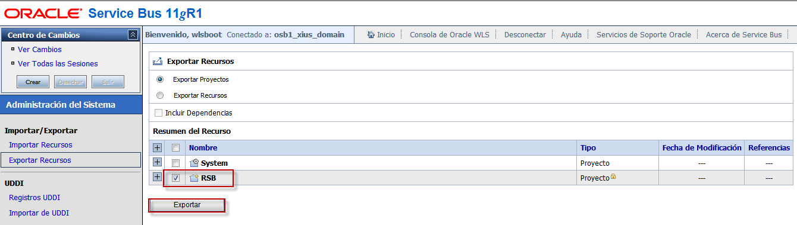

- Luego elegimos si queremos proteger los datos con una contraseña o no, y seleccionamos Terminar Exportación:

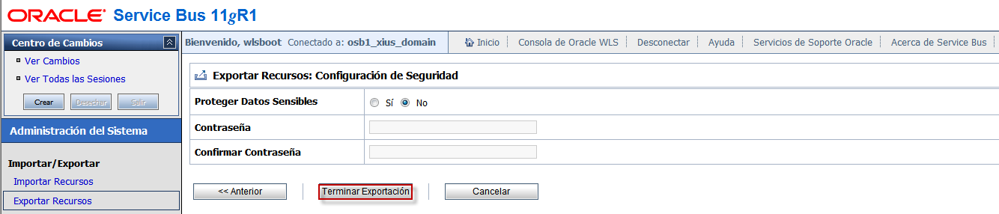

- Luego el sistema operativo nos mostrará un mensaje que la descarga a sido completada:

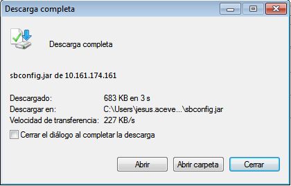

- Seguidamente ingresamos a la consola del bus de 12c:

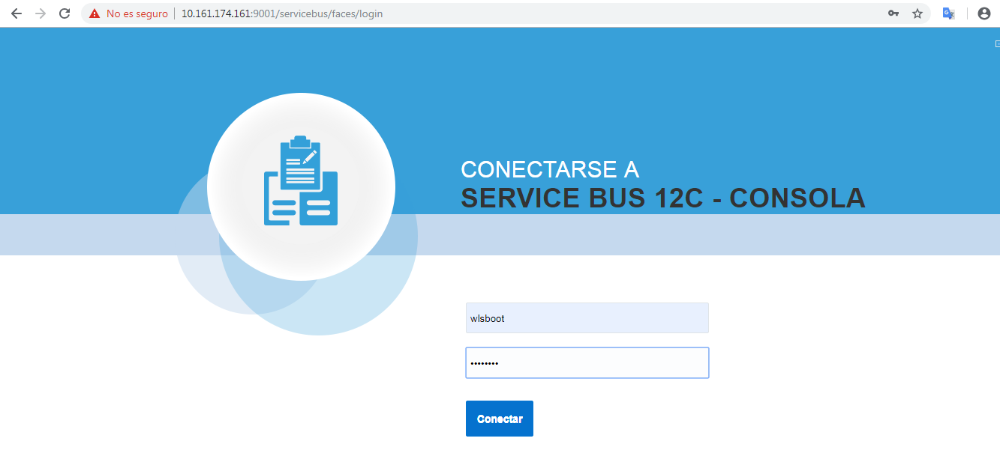

- Seleccionamos el botón crear:

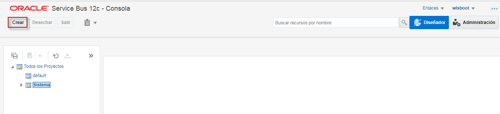

- Luego le damos al ícono de la flecha hacia abajo:

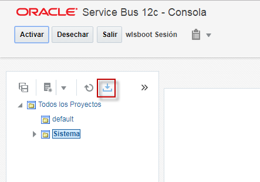

- Seleccionamos el archivo de la ubicación local que la tengamos:

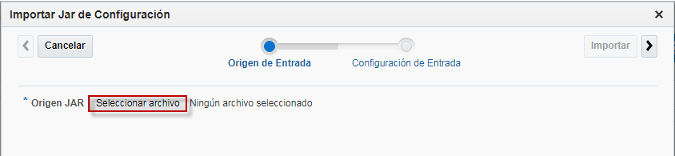

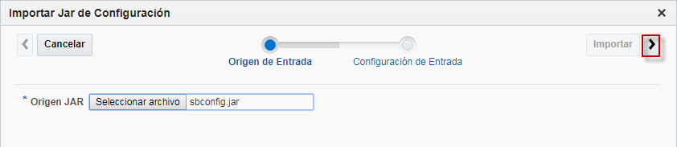

- Dejamos la configuración avanzada por defecto y le damos a la opción Importar:

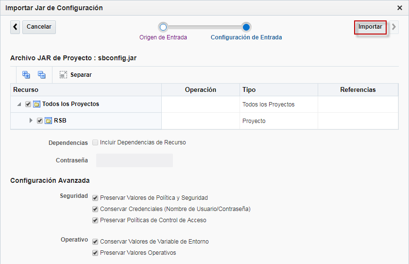

- Te mostrará los detalles de la importación y la severidad en caso de presentarse algún problema. En nuestro caso nos arrojó aproximadamente la mitad de los recursos con mensajes de diagnostico:

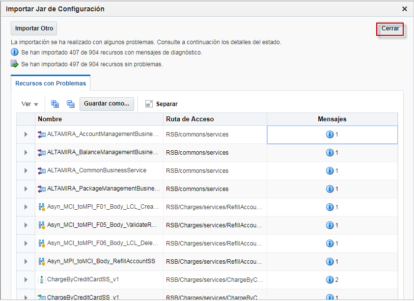

- Finalmente al desplegar la carpeta del proyecto, se puede observar todo su contenido:

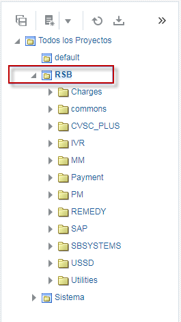

Cabe destacar, que en esta migración los servicios quedaron funcionando de manera satisfactoria en el nuevo Oracle Service Bus 12c, en um ambiente de producción.
