Creación de Servidores WTC
========

- En la pestaña Interoperabilidad, seleccionamos Servidores WTC, y luego Nuevo:

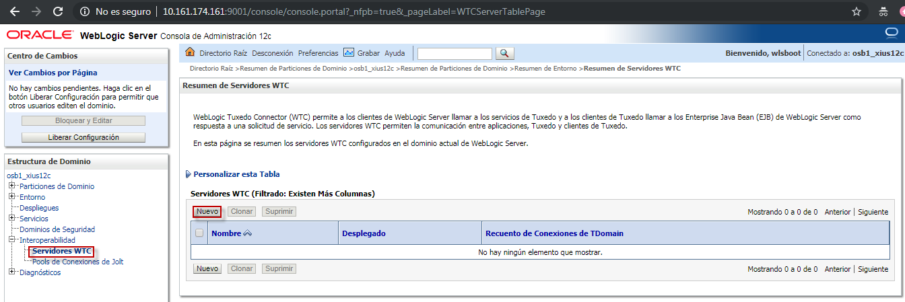

- Le asignamos el nombre del Servidor WTC: 

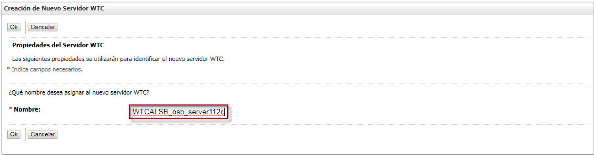

- Seleccionamos el nuevo servidor creado:

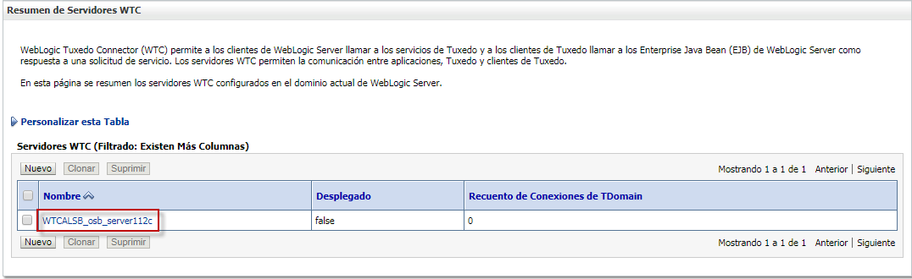

- Creamo un nuevo punto de acceso local:

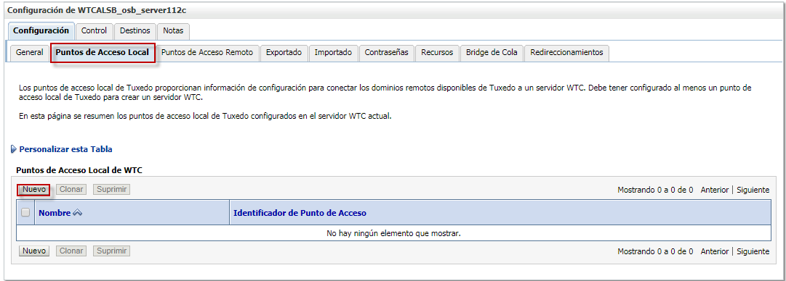

- Asignamos el nombre del punto de acceso, el identificador y el socket de escucha local y seleccionamos "ok":

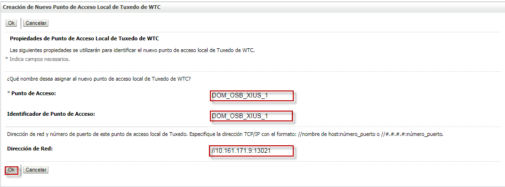

- Creamos un nuevo punto de acceso remoto: 

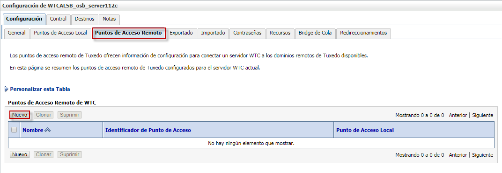

-  Asignamos el nombre del punto de acceso remoto, el identificador, el punto de acceso local, el socket de escucha remoto y le damos "ok":

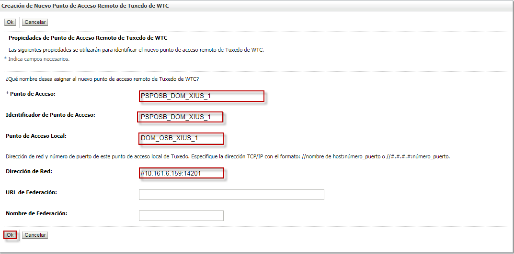

- Luego creamos un importado que contiene la información de como acceder a los servicios disponibles en los dominios remotos de Tuxedo:

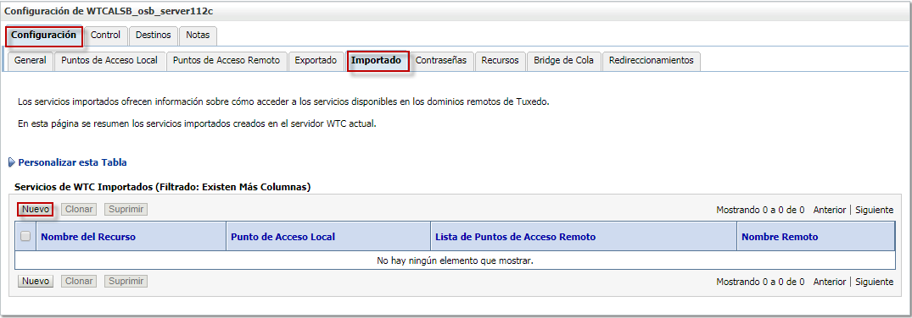

- Asignamos el nombre del recurso, el punto de acceso local, la lista de puntos de acceso remoto y el nombre remoto:

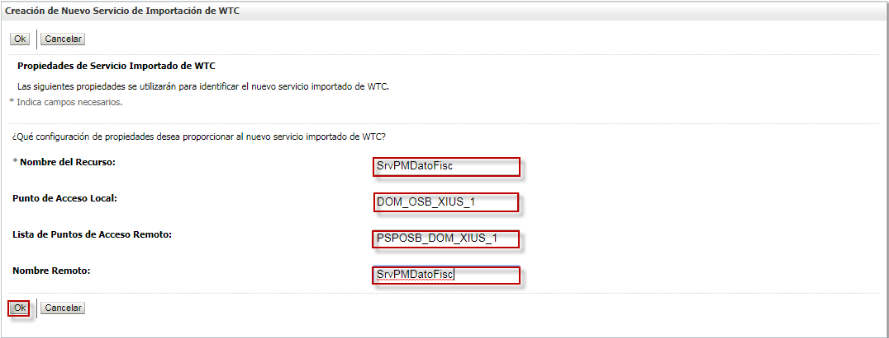

- Seleccionamos el servidor gestionado destino al que será asociado:

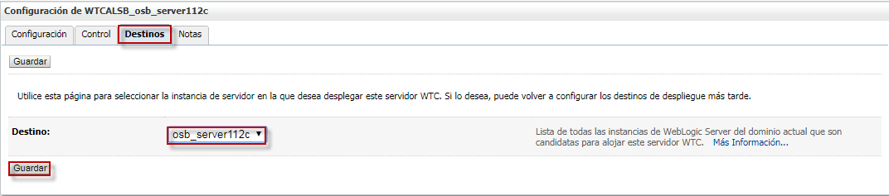

- Debemos crear tantos servidores WTC, como servidores gestionados tengamos, ya que como pudimos observar la relación es 1:1 :

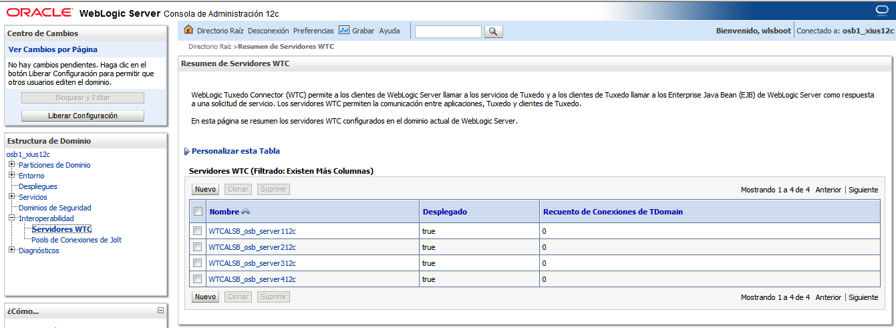

